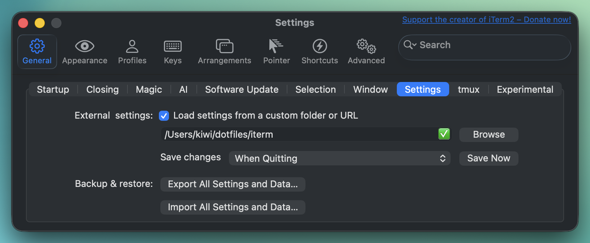

# My Dot files
My dot and atom files

## Install
### iTerm
https://www.iterm2.com/downloads.html

### HomeBrew
```sh
/bin/bash -c "$(curl -fsSL https://raw.githubusercontent.com/Homebrew/install/HEAD/install.sh)"
```

### Dropbox
https://www.dropbox.com/install

### VSCode
https://code.visualstudio.com/download
Download and run vscode.

### Postico
https://eggerapps.at/postico/


### Git
```
brew install git git-recent rbenv zsh direnv
```

### Volta
```sh
curl https://get.volta.sh | bash
```

Add node dependancies ember-cli and bower and yarn
```
volta install ember-cli bower yarn
```

### Ohmyzsh
```sh
sh -c "$(curl -fsSL https://raw.github.com/ohmyzsh/ohmyzsh/master/tools/install.sh)"
```

## Pull Configs
```sh
git clone git@github.com:kiwiupover/dotfiles.git
```

### Editor Font
http://www.dafont.com/bitstream-vera-mono.font

https://www.dropbox.com/home/DankMono


## Symlink Files

```sh
cd ~
mkdir code
mkdir projects
ln -shi dotfiles/.gitconfig .gitconfig
ln -shi dotfiles/.zshrc .zshrc
ln -shi dotfiles/.gitignore_global .gitignore_global
ln -shi dotfiles/.githelpers .githelpers
ln -shi ~/dotfiles/vscode/settings.json ~/Library/Application\ Support/Code/User/settings.json
ln -Fshfiv ~/dotfiles/vscode/snippets/ ~/Library/Application\ Support/Code/User/snippets
```

## iTerm2

Point iTerm2 to the dotfiles/iterm/itermsettings.json file to import the settings.


